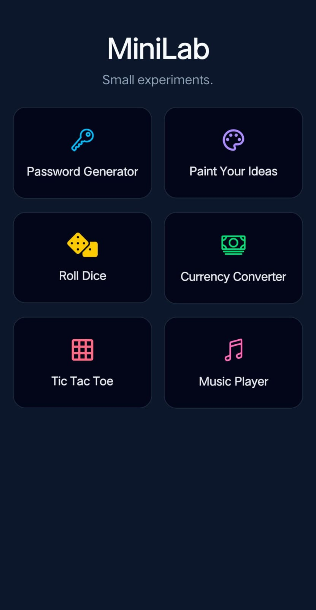
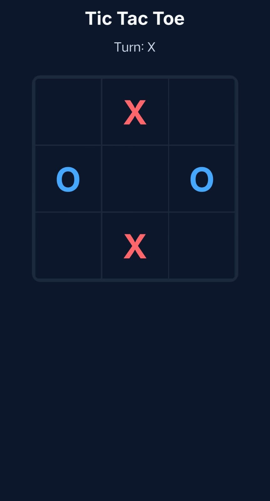
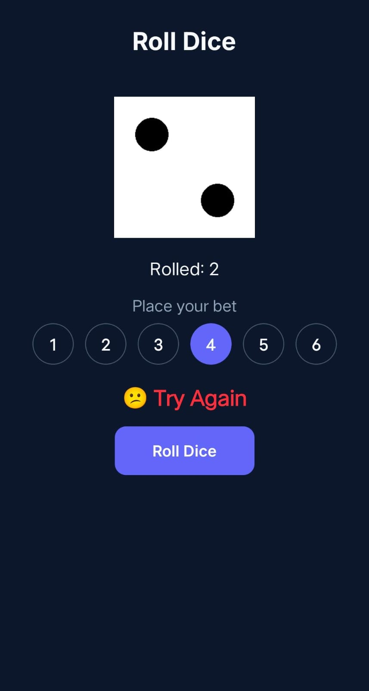
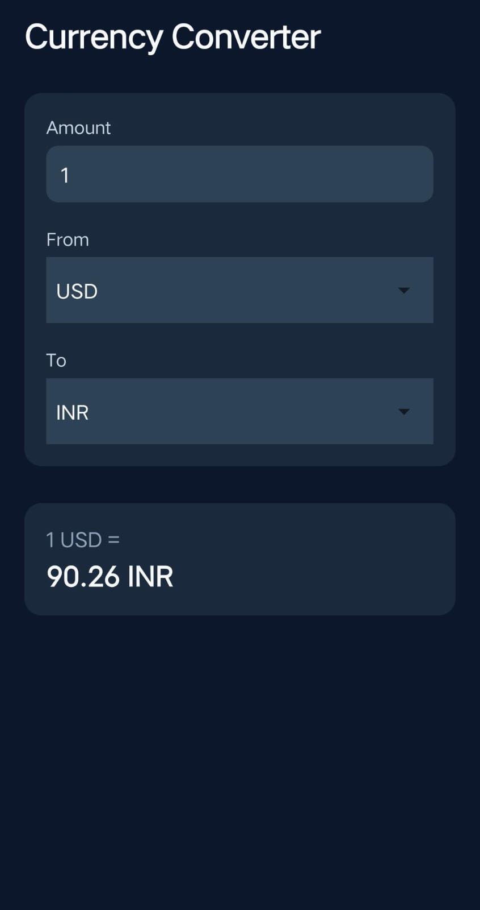
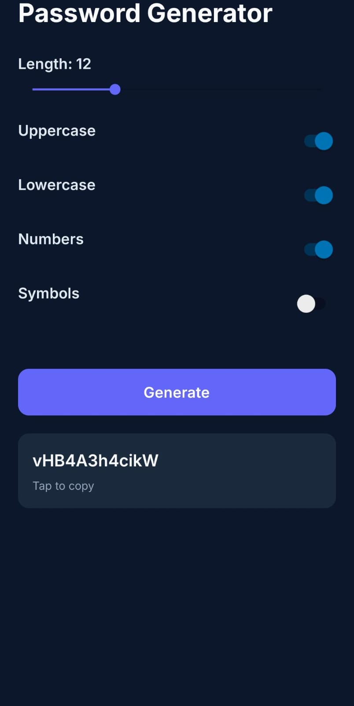

# MiniLab 
**A Modular React Native Playground (Expo + TypeScript)**

MiniLab is a **feature-driven React Native application** built to practice and demonstrate **core mobile development concepts** through small, focused, real-world mini features.

---

## What this project demonstrates

- **Core React Native concepts**  
  State management (`useState`, `useEffect`), navigation, side-effects, gestures, animations, audio, haptics, and API integration.

- **Hands-on mini features (logic + UI focused)**  
  Each screen is designed to solve a specific problem while keeping the UI clean and professional.

- **Production-ready UI fundamentals**  
  Reusable components, consistent theming, defensive error handling, and Expo-safe libraries.

---

## Features

- 🔐 **Password Generator** — configurable password logic  
- 🎨 **Paint / Doodle Screen** — freehand drawing using gestures & SVG  
- 🎲 **Dice Game** — animations, sound effects, haptics, and betting logic  
- 💱 **Currency Converter** — real-time rates fetched from live API  
- 🎵 **Music Player** — play/pause, seek slider, modern audio handling  

---

## 📸 Screenshots

| Home | Tic Tac Toe | Dice Bet |
|------|-------|------|
|  |  |  |

| Currency | Password Generator |
|---------|-------|
|  |  |

---

##  Tech Stack

- **React Native (Expo SDK 54)**
- **TypeScript**
- React Navigation
- Expo Audio & Haptics
- SVG for drawing
- REST API integration

---

## Why MiniLab?

> Instead of building one large app, MiniLab focuses on **understanding fundamentals deeply** by implementing multiple small features — each targeting a specific mobile development concept.

This makes it ideal as a **learning project**, **internship portfolio**, or **concept reference app**.

---

## Getting Started

```bash
git clone https://github.com/your-username/minilab.git
cd minilab
npm install
npx expo start
